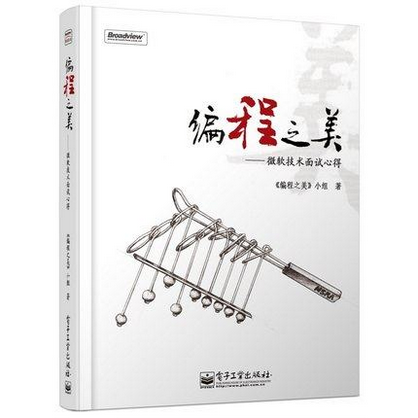
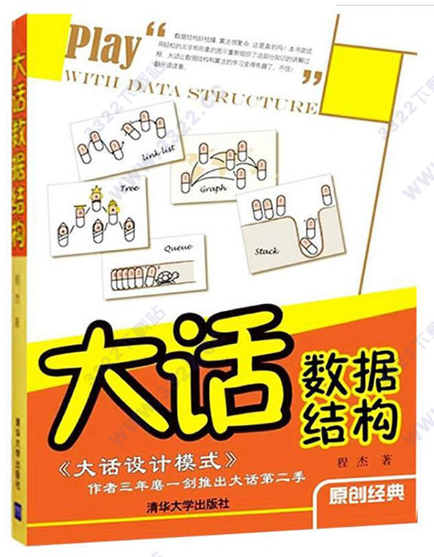

# 算法笔记

## 本仓库内容

1. 常用算法分析及源码
2. 剑指offer面试题及源码
2. 牛客网刷题笔记

```
Something I hope you know before go into the coding~
First, please watch or star this repo, I'll be more happy if you follow me.
Bug report, questions and discussion are welcome, you can post an issue or pull a request.
```

## 相关站点

* GitHub地址:<https://github.com/yifengyou/learn-algorithm>

* GibBook地址:<https://yifengyou.gitbooks.io/learn-algorithm/content/>

* leetcode:<https://leetcode.com/>

* leetcode中国站:<https://leetcode-cn.com/explore/>

* 南阳理工:<http://acm.nyist.edu.cn/JudgeOnline/login.php>

* acm俱乐部:<http://www.acmclub.cn/>

## 目录

* [十大经典排序算法](docs/十大经典排序算法/十大经典排序算法.md)
    * [快速排序](docs/十大经典排序算法/快速排序.md)
    * [选择排序](docs/十大经典排序算法/选择排序.md)
    * [插入排序](docs/十大经典排序算法/插入排序.md)
    * [希尔排序](docs/十大经典排序算法/希尔排序.md)
    * [归并排序](docs/十大经典排序算法/归并排序.md)
    * [快速排序](docs/十大经典排序算法/快速排序.md)
    * [堆排序](docs/十大经典排序算法/堆排序.md)
    * [计数排序](docs/十大经典排序算法/计数排序.md)
    * [桶排序](docs/十大经典排序算法/桶排序.md)
    * [冒泡排序](docs/十大经典排序算法/冒泡排序.md)
    * [基数排序](docs/十大经典排序算法/基数排序.md)
    * [基数排序vs计数排序vs桶排序](docs/十大经典排序算法/基数排序vs计数排序vs桶排序.md)
* [七大经典查找算法](docs/七大经典查找算法/七大经典查找算法.md)
    * [顺序查找](docs/七大经典查找算法/顺序查找.md)
    * [二分查找](docs/七大经典查找算法/二分查找.md)
    * [插值查找](docs/七大经典查找算法/插值查找.md)
    * [斐波那契查找](docs/七大经典查找算法/斐波那契查找.md)
    * [树表查找](docs/七大经典查找算法/树表查找.md)
    * [分块查找](docs/七大经典查找算法/分块查找.md)
    * [哈希查找](docs/七大经典查找算法/哈希查找.md)
* [五大常用算法](docs/五大常用算法/五大常用算法.md)
    * [穷举法](docs/五大常用算法/穷举法.md)
    * [贪婪算法](docs/五大常用算法/贪婪算法.md)
    * [动态规划算法](docs/五大常用算法/动态规划算法.md)
    * [分治算法](docs/五大常用算法/分治算法.md)
    * [回溯算法](docs/五大常用算法/回溯算法.md)
    * [分支限界算法](docs/五大常用算法/分支限界算法.md)
* [高频算法题](docs/高频算法题/高频算法题.md)
    * [倒序打印一个单链表](docs/高频算法题/倒序打印一个单链表.md)
    * [反转单链表](docs/高频算法题/反转单链表.md)
    * [两个栈实现一个队列](docs/高频算法题/两个栈实现一个队列.md)
    * [int型的数中二进制中的个数](docs/高频算法题/int型的数中二进制中的个数.md)
    * [判断字符串子串](docs/高频算法题/判断字符串子串.md)
    * [两个链表找公共节点](docs/高频算法题/两个链表找公共节点.md)
    * [找链表倒数第K个节点](docs/高频算法题/找链表倒数第K个节点.md)

## 参考博客

* 郭耀华's Blog:<https://www.cnblogs.com/guoyaohua/p/8600214.html>
* 来自师范的学渣:<https://blog.csdn.net/qq_40788630/article/details/79503946>
* 尘语凡心:<https://www.jianshu.com/p/42f81846c0fb>
* Miracles happen every day:<https://blog.csdn.net/hactrox/article/details/38775209>

## 参考书籍







## 总结

```
* 理解是第一要义~
* 写代码是一种艺术，而不是搬砖~
* 理论联系实际，知道怎么操作，代码要会写，源码要看的懂~
```

PS:仅为个人学习笔记总结，没有半毛钱商业利益。很多内容摘自网络，博主别打我。看不惯绕道。能学到东西才是最要紧的~
