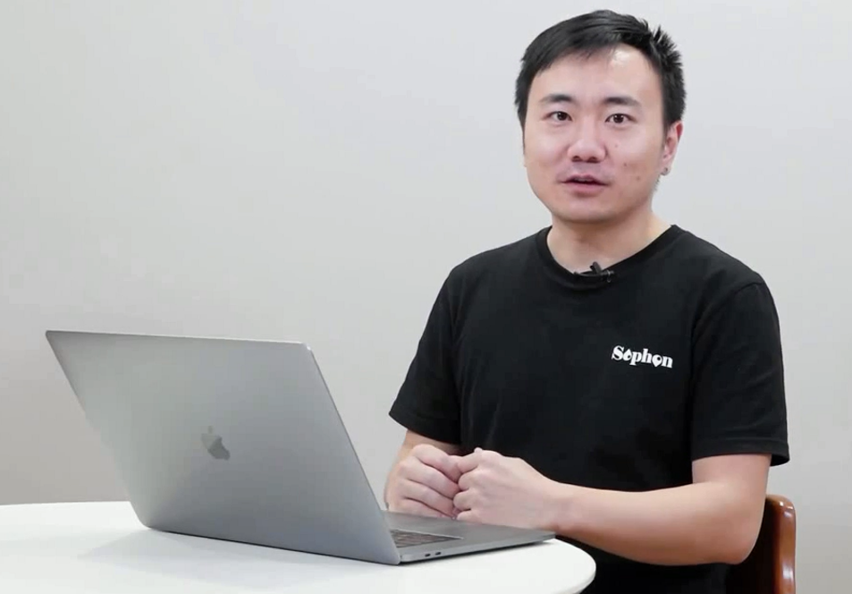
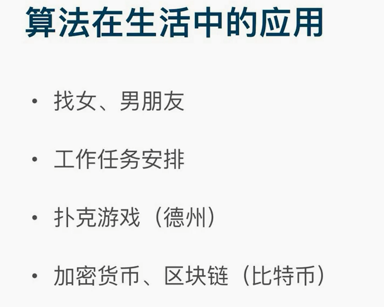
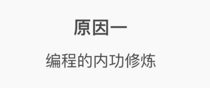
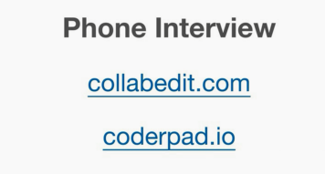
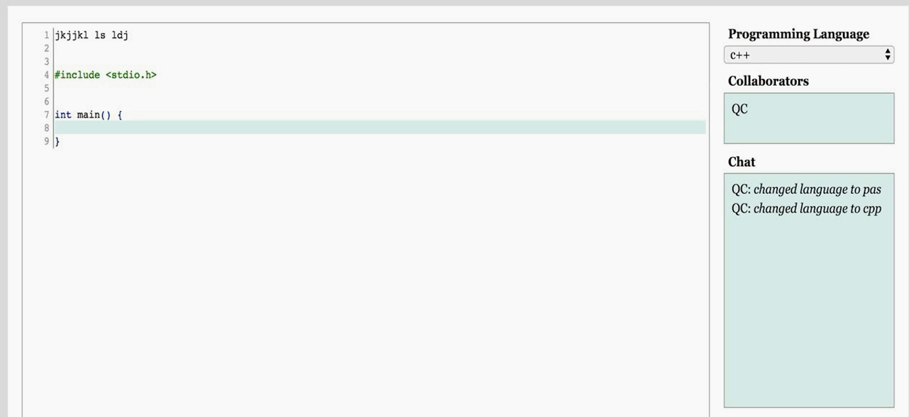
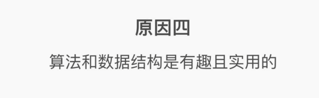
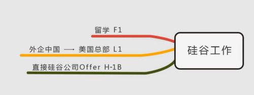
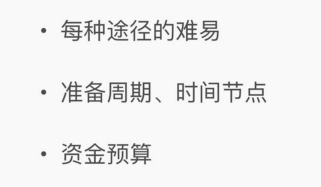
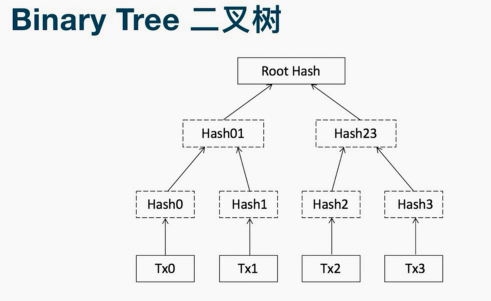
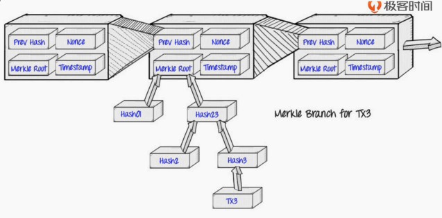

<!-- MDTOC maxdepth:6 firsth1:1 numbering:0 flatten:0 bullets:1 updateOnSave:1 -->

- [合格程序员的第一步_算法与数据结构](#合格程序员的第一步_算法与数据结构)   
   - [为什么算法很重要](#为什么算法很重要)   
      - [编程是内功](#编程是内功)   
      - [国内互联网巨头必备技能](#国内互联网巨头必备技能)   
      - [面试必考](#面试必考)   
      - [算法数据结构确实有趣](#算法数据结构确实有趣)   
   - [去硅谷工作路径图](#去硅谷工作路径图)   
   - [找蓝盆友、铝朋友](#找蓝盆友、铝朋友)   
   - [工作任务安排](#工作任务安排)   
   - [德州扑克](#德州扑克)   
   - [比特币](#比特币)   

<!-- /MDTOC -->
# 合格程序员的第一步_算法与数据结构

大佬带我飞~

* 为什么要学算法？算法重要吗？

## 为什么算法很重要

### 编程是内功

* 高手内力雄厚，学招式快N倍
* 小白常问什么招式好，什么语言简单

### 国内互联网巨头必备技能

* 面试常问算法数据结构问题
* 面试要求写程序，写算法，靠算法和数据结构，编程功底
* 招式是其次，编程内力功底是本原

### 面试必考

电话面试开始

* <http://coderpad.io>
* <http://collabedit.com>

* 实时手撸代码

* 现场手撸代码，画结构图

### 算法数据结构确实有趣

* 有利于理解当红技术

## 去硅谷工作路径图

* 这年头，新冠严重一匹，还是能不出门就不出门
* 老老实实待在国内，老老实实996
* 什么时候财富自由？转身就去迫害下一代程序员

* 纯属废话专题

## 找蓝盆友、铝朋友

* 找了个N个，只要第N个比之前的好，就选她了，就是最优解

## 工作任务安排

* 任务安排决定了升职快慢
* 如果对待每天的任务
  - 不要用队列，不要用栈
  - 建立一个优先队列，优先级最高的任务放在最开始
    - 优先级最高肯定是最难，比较痛苦但是很有用

## 德州扑克

* 扑克里的数学常识
* 手牌，范围是多少？如何让长期收益趋向于正直

## 比特币

* 区块链、加密货币中有大量算法，数据结构知识

比特币结构，每个区块用一个指针指向前继节点（单向链表）。最基本的数据结构

可否改成树/图？每个交易记录就是一个哈希值，两两合并成哈希值，这样存好处是什么？只要有一个root，那么其他所有交易不能被篡改，否则不一致

* 最上层是链表结构
* 每个block下面就是一棵树

---
