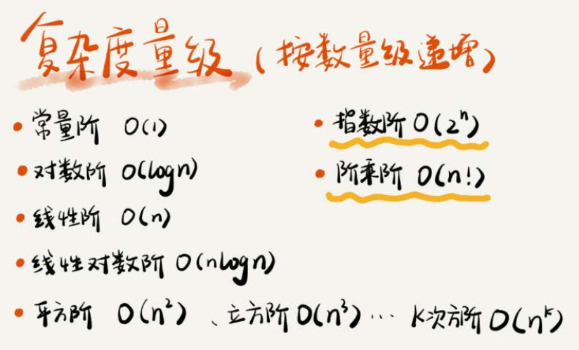
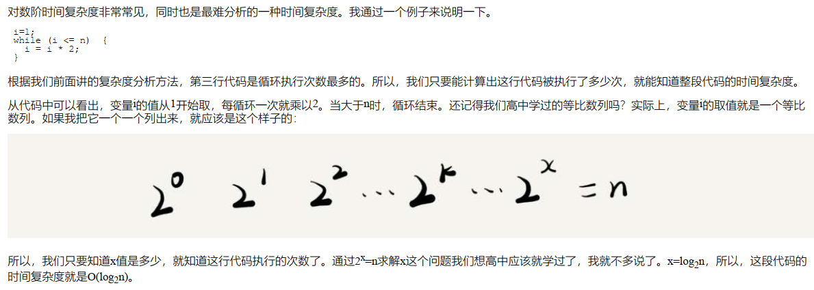
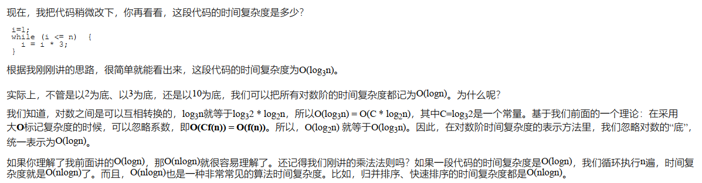
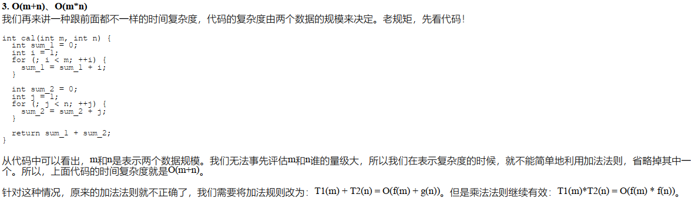
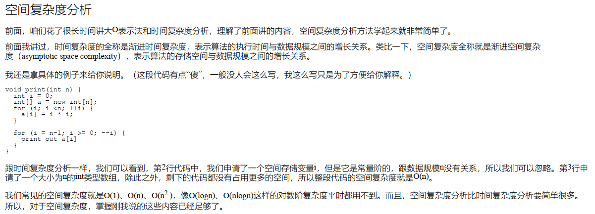
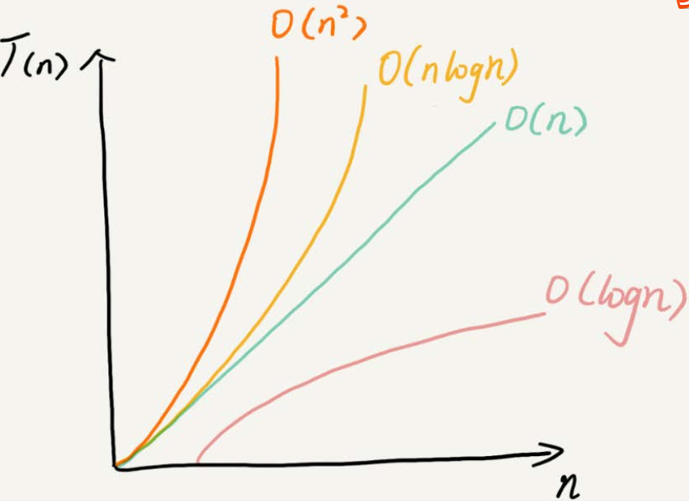

# 复杂度分析1_如何分析统计算法的执行效率和资源消耗

* 数据结构和算法就是为了提升性能，就是要快，要省

## 为什么需要复杂度分析？

* 与数据规模有关

## 大O复杂度表示法

* T(n)它表示代码执行的时间
* n表示数据规模的大小
* f(n)表示每行代码执行的次数总和。
* 因为这是一个公式，所以用f(n)来表示。公式中的O，表示代码的执行时间T(n)与f(n)表达式成正比。

## 时间复杂度分析

1.只关注循环执行次数最多的一段代码
2.加法法则：总复杂度等于量级最大的那段代码的复杂度
3.乘法法则：嵌套代码的复杂度等于嵌套内外代码复杂度的乘积

## 几种常见时间复杂度实例分析

### o(1)

* 常量级别
* 给出具体N就是常量

### o(nlogn) 与 o(logn)

* 每次都是乘以2，那么前面i是给定长常数，常数是可以忽略的。只考虑2的话就是2的阶乘等于n。同理，乘以3,4,5...一样的道理。时间复杂度就是考虑执行了多少次
* 一般题目都比较规矩，n就是变量，但如果起始也是n表示，那么就是常量
* 大O标记复杂度的时候，可以忽略系数，即O(Cf(n)) = O(f(n))。所以， O(log2n) 就等于O(log3n)。因此，在对数阶时间复杂度的表示方法里，我们忽略对数的“底”，
统一表示为O(logn)

### o(n+m) o(n*m)

## 空间复杂度分析

* 空间复杂度看变量申请（内存开销）与问题规模的关系
* 栈上的变量属于常熟级别
* 堆上的需要考虑。一定要记住前提，问题达到规模时候复杂度才是空间复杂度

## 总结

* 低阶到高阶有： O(1)、 O(logn)、 O(n)、 O(nlogn)、 O(n2)
* 多项式阶：随着数据规模的增长，算法的执行时间和空间占用，按照多项式的比例增长。包括，
O(1)（常数阶）、 O(logn)（对数阶）、 O(n)（线性阶）、 O(nlogn)（线性对数阶）、 O(n^2)（平方阶）、 O(n^3)（立方阶）
* 非多项式阶：随着数据规模的增长，算法的执行时间和空间占用暴增，这类算法性能极差。包括，O(2^n)（指数阶）、 O(n!)（阶乘阶）

---
