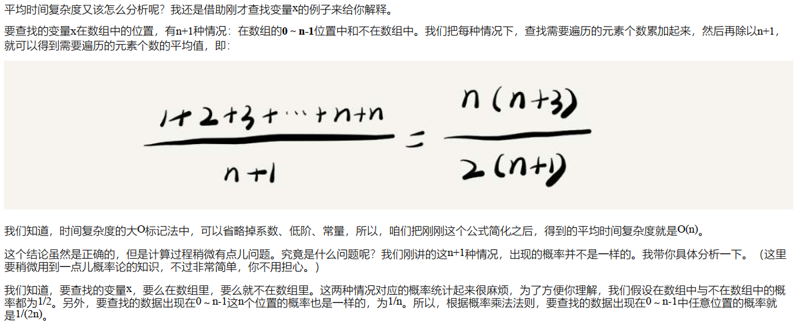

# 04复杂度分析2_浅析最好最坏平均均摊时间复杂度

* 最好情况时间复杂度（best case time complexity）
* 最坏情况时间复杂度（worst case time complexity）
* 平均情况时间复杂度（average case time complexity）
* 均摊时间复杂度（amortized time complexity）

## 平均情况时间复杂度

* 平均时间复杂度的全称应该叫加权平均时间复杂度或者期望时间复杂度
* 很多时候，我们使用一个复杂度就可以满足需求了。只有同一块代码在不同的情况下，时间复杂度有量级的差距，我们
才会使用这三种复杂度表示法来区分。

## 均摊时间复杂度

## 总结

1. 最坏情况时间复杂度：代码在最理想情况下执行的时间复杂度。
2. 最好情况时间复杂度：代码在最坏情况下执行的时间复杂度。
3. 平均时间复杂度：用代码在所有情况下执行的次数的加权平均值表示。
4. 均摊时间复杂度：在代码执行的所有复杂度情况中绝大部分是低级别的复杂度，个别情况是高级别复杂度且发生具有时序关系时，可以将个别高级别复杂度均摊到低级别复杂度上。基本上均摊结果就等于低级别复杂度。

---
