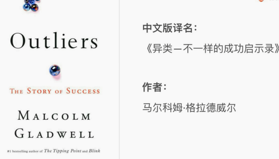
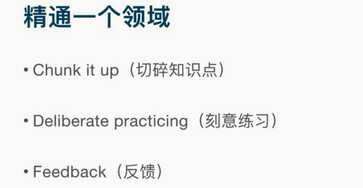
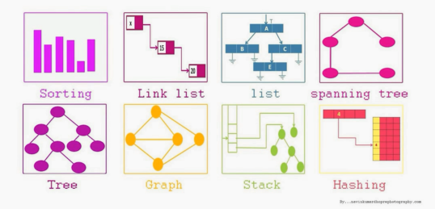
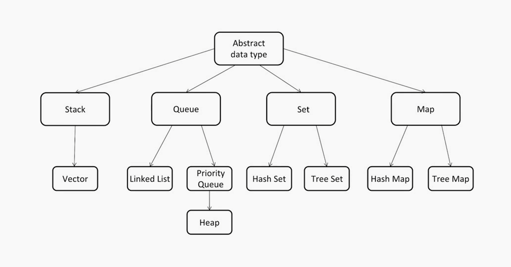
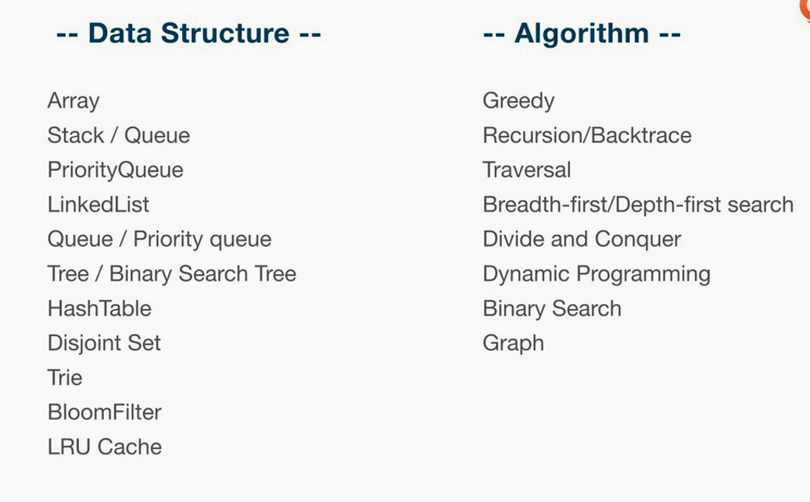
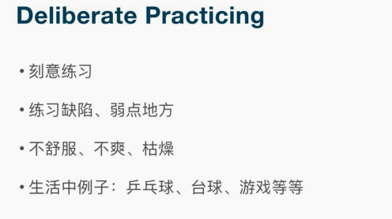
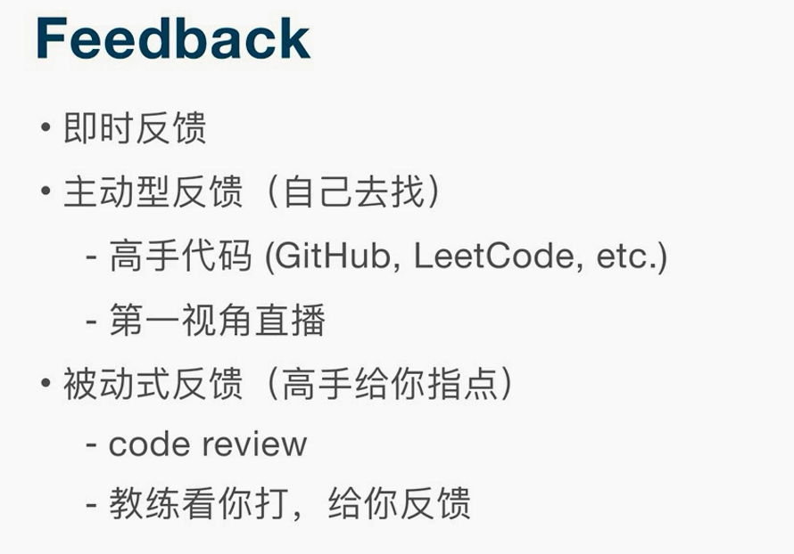

# 如何事半功倍地学习算法与数据结构

* 不需要背诵，要理解

## 方法论

* 一万小时定律

如何精通一个领域

* 切碎知识点
  - 大知识点分成小块
* 刻意练习
  - 注重脉络
* 得到反馈feedback

### 切碎知识点

类似于游戏，王者荣耀套路贼多

* 主干分支，挂载，联系起来

### 刻意练习

* 不舒服，不爽，感觉就对了
* 就是要发掘不舒服的情况

### 得到反馈feedback

* 主动反馈
  - 主动看高手代码
* 被动反馈
  - 项目实战
  - 高手指点
  - 可遇不可求

## 切题四件套

* 明确题目意思
* 所有可能解列出来
  - 对比
  - 加强
* 写代码
* 测试用例

---
