# 如何抓住重点_系统高效地学习数据结构与算法

* 望而却步，是因为没抓到重点，没找到方法
* 适合的学习方法事半功倍

## 什么是数据结构？什么是算法？

* 定义一般很抽象，理解概念没有帮助
* 广义：数据结构就是数据在储存设备的排列方式，算法就是操作这些放在存储设备的数据的处理方法
* 二者相辅相成，相互服务，无法孤立讨论
* 数据结构是静态的，没有操作，没有算法就没有灵魂

## 学习这个专栏需要什么基础？

* 基本数学理论，基本编程基础
* 如何提高效率，如何节省空间
* 教你是什么，为什么？怎么优化
* 紧紧抓住多解决办法，并且掌握比较理论，掌握优化

## 学习的重点在什么地方？

* 务必掌握复杂度分析，考量效率和复杂度方法
* 掌握特点用法，但是没有掌握复杂度分析，那就是相当于只有口诀，没掌握心法

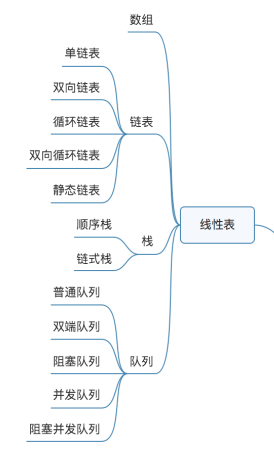

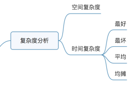

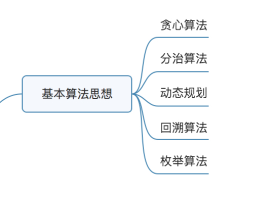

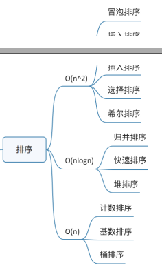

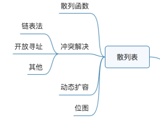

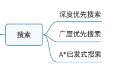

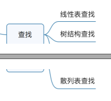

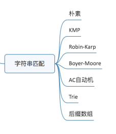

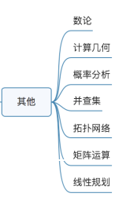

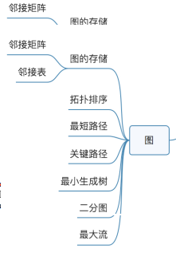

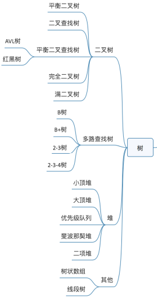

## 一些可以让你事半功倍的学习技巧

### 边学边练习，多联系，用起来

### 思考自己的学习方法，总结方法，发现自己困难点，发现自己拖延的地方

### 打怪升级

* 看经验值，成就感
* 枯燥的学习，定一个目标

## 总结

* 数据结构：数组、链表、栈、队列、散列表、二叉树、堆、跳表、图、Tire树
* 算法： 递归、排序、二分查找、搜索、哈希算法、贪心算法、分治算法、回溯算法、动态规划、字符串匹配算法

---
