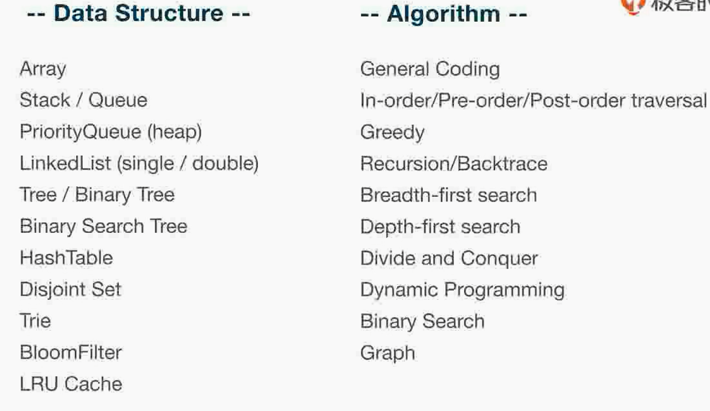
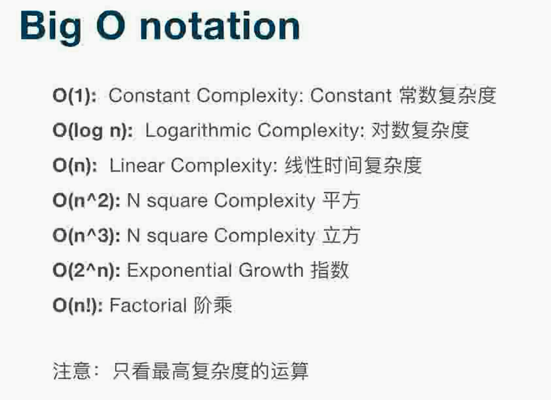
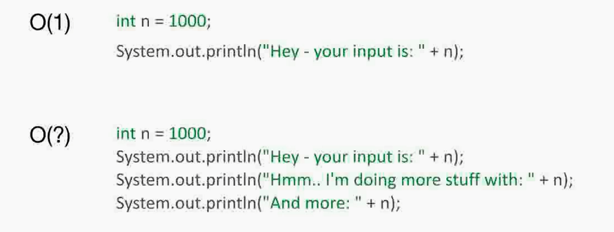
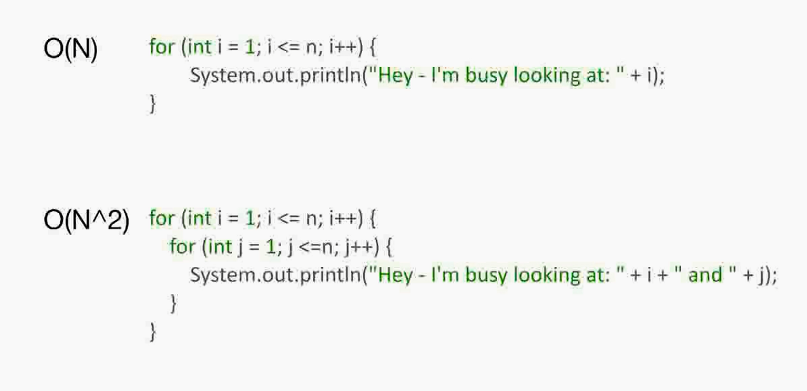
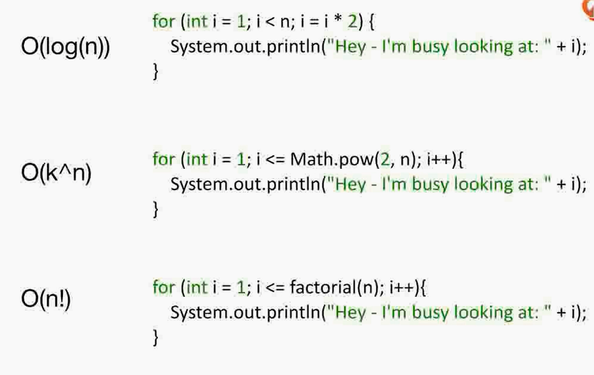
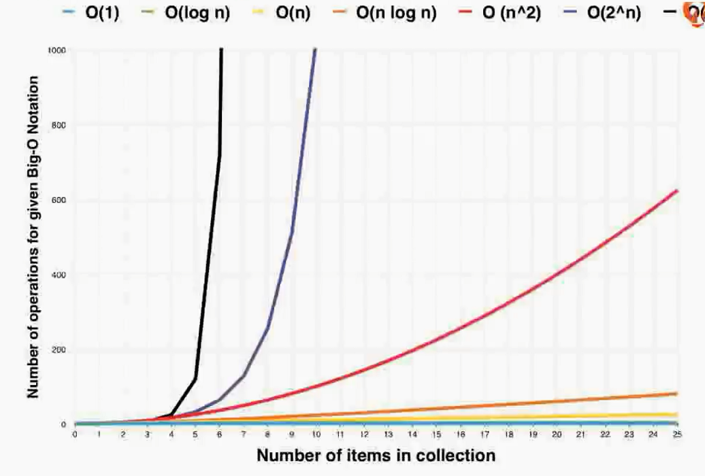
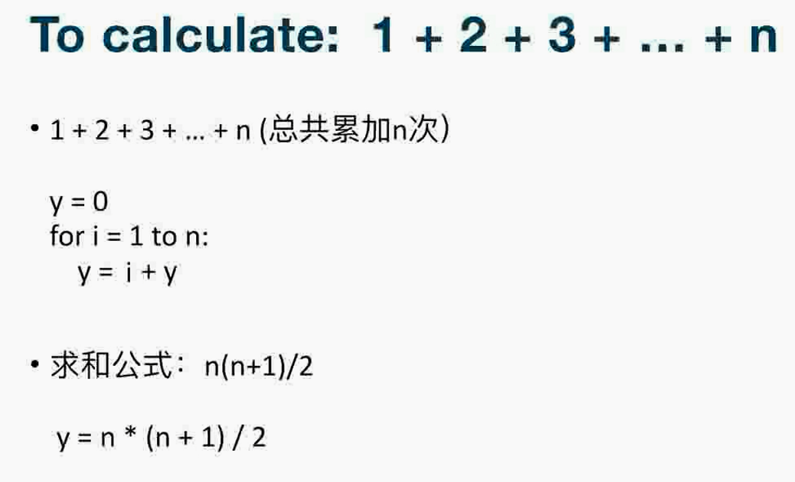
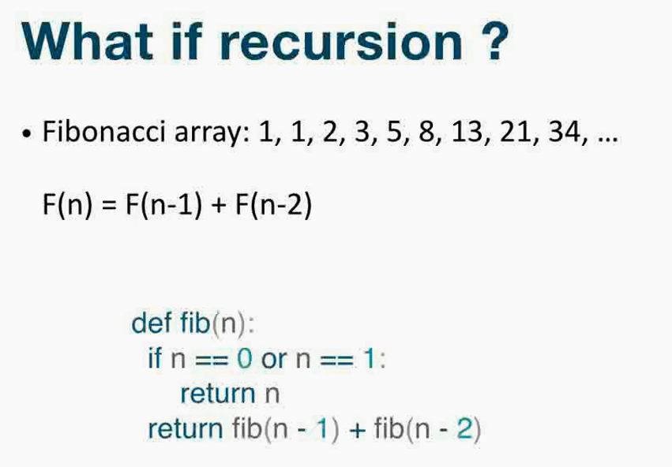
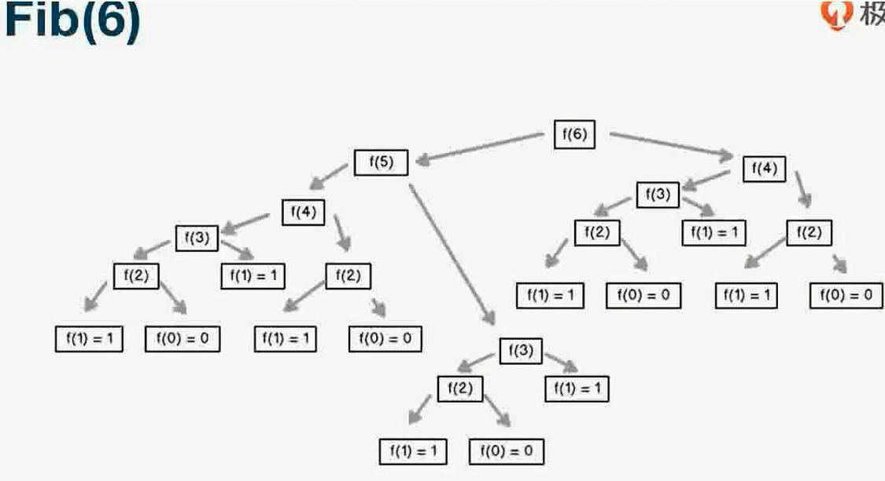
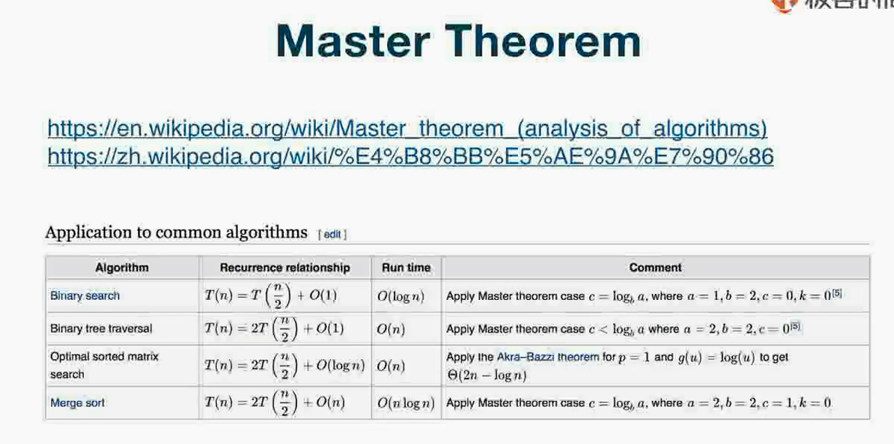

# 如何计算算法的复杂度

从简单到难

* 数组
* 栈/队列
* 优先队列（堆）
* 链表（单、双链表）
* 树、二叉树
* 二叉搜索树
* 哈希表
* 并查集
* 字典树，又称单词查找树
* 布鲁姆过滤器
* 最近最久未使用缓存

算法

1. 经典常用编程题目，硬写代码即可
2. 前序中序后续遍历算法
3. 贪心算法
4. 回溯、递归算法
5. 深度优先
6. 广度优先
7. 分治算法
8. 动态规划
9. 二分查找
10. 图

## 时间复杂度、空间复杂度

* 必须关注，不然就是业余
* 机械式反应，时间空间复杂度有所了解
* 就跟开车，还剩多少油相关

### 时间复杂度

* 时间复杂度，求极限

* 递归代码时间复杂度怎么计算？

## 主定律

---
