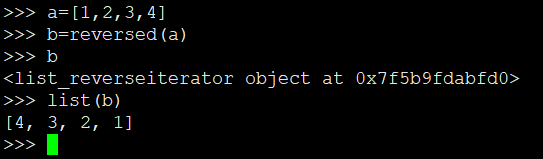
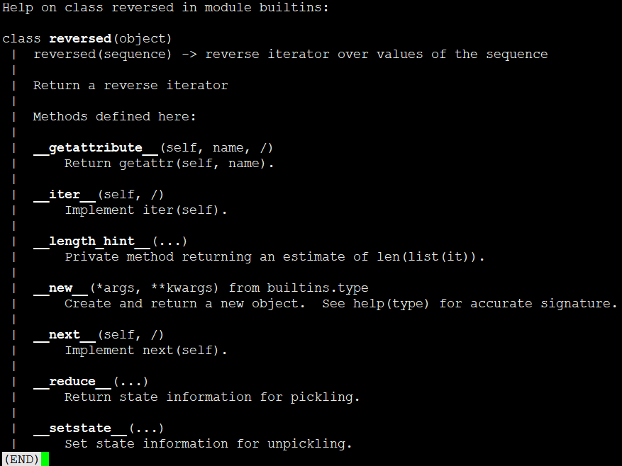
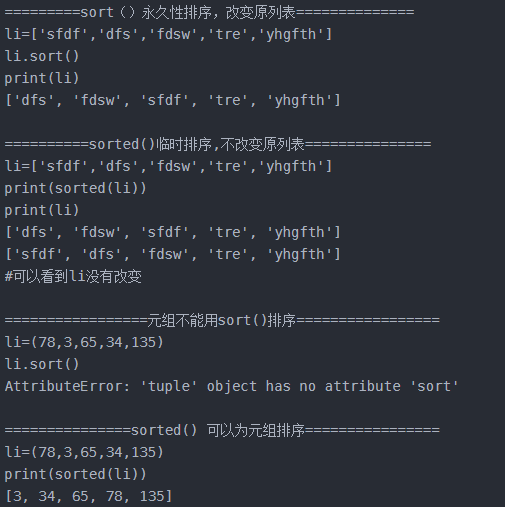

# Python常用函数

## 字符串

```
.strip() 去除首尾空格
.split()  分割
.strip().strip(‘-a’)去除首尾空格和字符‘-a’
.replace(‘a’,’b’) 替换字符
S[:3]、S[5:] 、S[5:7]（前3、第5之后、5到7）拼接字符串，去除某个字符
.index(str,beg,end) 返回开始索引或异常
.find(str,beg,end) 返回开始索引或-1
```

## 列表

```
.remove(具体内容)
.pop(索引号)    
del a[索引号]
.append()
.extend()
.reverse # 立即修改
.max
.min
.len
.sort(cmp=None, key=None, reverse=False) # 默认小到大
.index # 获取索引值
.count # 出现次数
```

* sort是容器的函数：sort(cmp=None, key=None, reverse=False)
* sorted是python的内建函数：sorted(iterable, cmp=None, key=None, reverse=False)

对于sort和reverse都是list列表的内置函数，一般不传参数，没有返回值，会改变原列表的值。
而sorted和reversed是python内置函数，需要传参数，参数可以是字符串，列表，字典，元组，不管传的参数是什么sorted返回的都是列表，reversed返回的都是迭代器，原参数的值不会发生改变。

* reverse() 是python一个列表的内置函数，是列表独有的，用于列表中数据的反转，颠倒
* reversed()是python自带的一个方法，准确来说是一个类





* sort()
* sorted()

 
