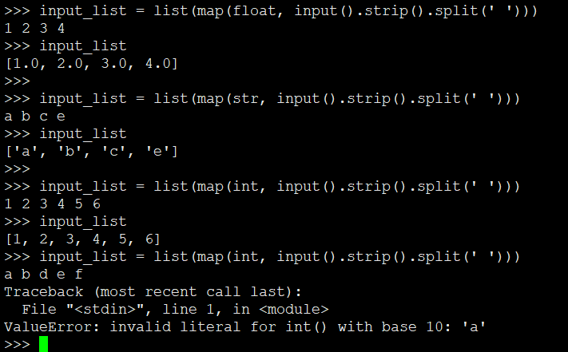
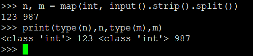

# Python输入输出

## 单行输入

* 字符串

单行：

```
import sys
line = sys.stdin.readline().strip()
print(line) # 输出的字符串
```

直接使用input也可以达到相同的效果。 input() 函数接受一个标准输入数据，返回固定为**string 类型**。

在Python 2中input() 在对待纯数字输入时具有自己的特性，它返回所输入的特定类型。（已经废弃，只做了解）


* Python 3中input是内建函数，不需要导入任何包即可使用。
* 默认没有任何提示，可加参数作为提示内容。例如```input("please input something")```
* input自动忽略换行符号
* input只返回string
* input会strip换行符，但是空格，tab仍然保留，因此必须strip()
* Python 3版本的input本质是Python 2版本input + raw_input
* 如果输入Ctrl + D 或 Ctrl + Z 会触发EOFError

```
line = input()
print(line) # 输出为字符串
```

* 数字、小数

```
n=int(input())
print(n) # 输出为数字
```

```
n=float(input())
print(n) # 输出为小数
```

* 单行输入输出为数组

```
l = list(  map( int , input().split(" ")  ) )
print(l)
```

其中

* map是内建函数，无需导入任何包
* map() 会根据提供的函数对指定序列做映射。
* 第一个参数 function 以参数序列中的每一个元素调用 function 函数，返回包含每次 function 函数返回值的新列表。


```
>>> def square(x) :         # 计算平方数
...     return x ** 2
...
>>> map(square, [1,2,3,4,5])    # 计算列表各个元素的平方
<map object at 0x100d3d550>     # 返回迭代器
>>> list(map(square, [1,2,3,4,5]))   # 使用 list() 转换为列表
[1, 4, 9, 16, 25]
>>> list(map(lambda x: x ** 2, [1, 2, 3, 4, 5]))   # 使用 lambda 匿名函数
[1, 4, 9, 16, 25]
>>>
```


## 多行输入

* 给定行数

```
n = int(input())
data = []
for _ in range(n):
    line = input()
    data.append(line)
print(data)
```


* 不给定行数

```
import sys

data=[]
while True:
  line = sys.stdin.readline().strip() # 此处也可以用input实现, line=input().strip()
  if not line:
      break
data.append(line)
print(" + ".join(data))
```

比如输入
```
1

2

3
```
输出：

```1 + 2 + 3```

输入可能Ctrl+D、Ctrl+Z结尾，所以可以加except处理

```
res = []
while True:
    try:
        s = input()
        # res.append(list(map(int, s.split(' '))))
        res.append(list(map(str, s.split(' '))))
    except:
        break
```

## 输入转为特定类型的列表

* 注意类型

```
input_list = list(map(int, input().strip().split(' ')))
input_list = list(map(str, input().strip().split(' ')))
input_list = list(map(float, input().strip().split(' ')))
```


## 单行输入赋值给多个变量（固定数量）

```
a,b,c = [int(i) for i in input().split()]
print(a,b,c)
```


```
n, m = map(int, sys.stdin.readline().strip().split())
n, m = map(int, input().strip().split())
```

 


## 输出形式为矩阵

* 矩阵实为列表的列表

```
import sys

data=[]
while True:
    line = sys.stdin.readline().strip() # 或者 line = input()
    if not line:
        break
    tmp = list(map(int, line.split(" ")))
    data.append(tmp)

print(data)
```

## 输出不换行

```
print("output content", end='')
```

---
