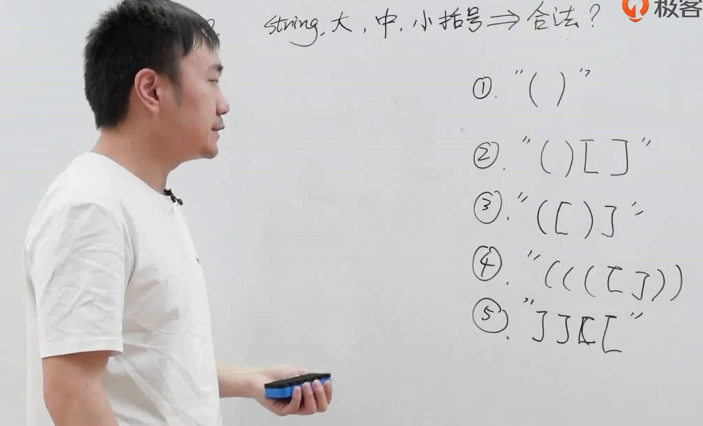
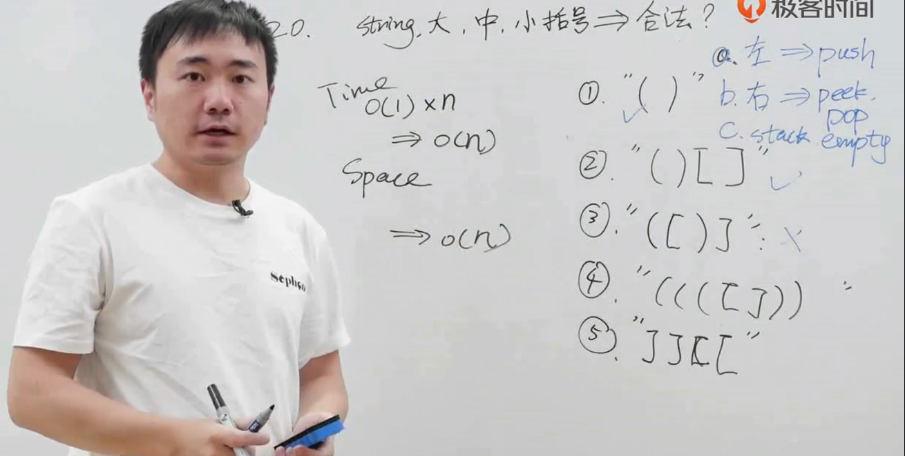
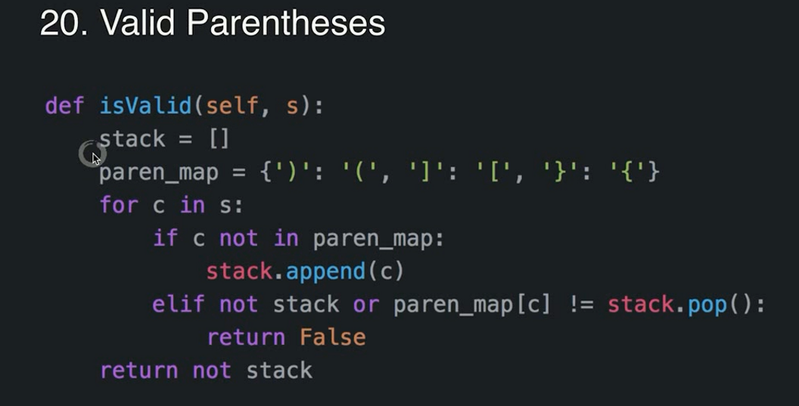
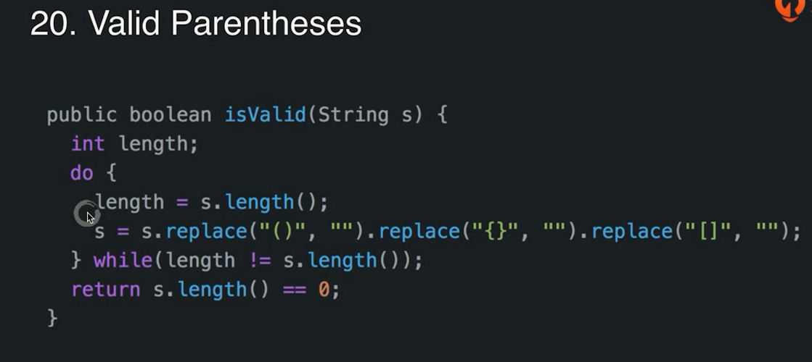

# 面试题_判断括号字符串是否有效

## 堆栈解法

1. 对于左括号，肯定是合法的，需要判断是否有右括号匹配，留着就是放到堆栈中，存着，等待右括号
2. 对于右括号，需要与左括号匹配，女人就得找男人。如果匹配就得弹出栈中的左括号
3. 最终走完，栈必须是空的

* 使用字典
  - 如果不是左括号，下一步，否则压入栈
  - 如果是右括号，就要匹配栈顶

* 另一种解法，时间复杂度不好判断n平方层级
* 没有比stack更优秀，不过好理解

---
