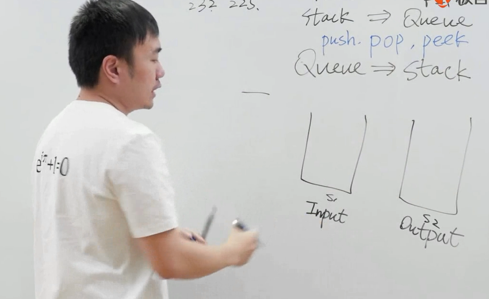

# 面试题_用队列实现栈&用栈实现队列

* LeetCode 232 225题目

## 使用队列实现堆栈

* 使用辅助队列
* 每次入栈，之前所有元素都到辅助队列，然后重新入队列
* 每次出出栈，就从队头弹出一个元素

## 使用栈实现队列

* 分成输入栈，输出栈
* 遇到输入，放到输入栈
* 遇到pop，把所有输入栈放到输出栈，并且pop
* 遇到peek，把所有输入栈放到输出栈，并且peek

---
