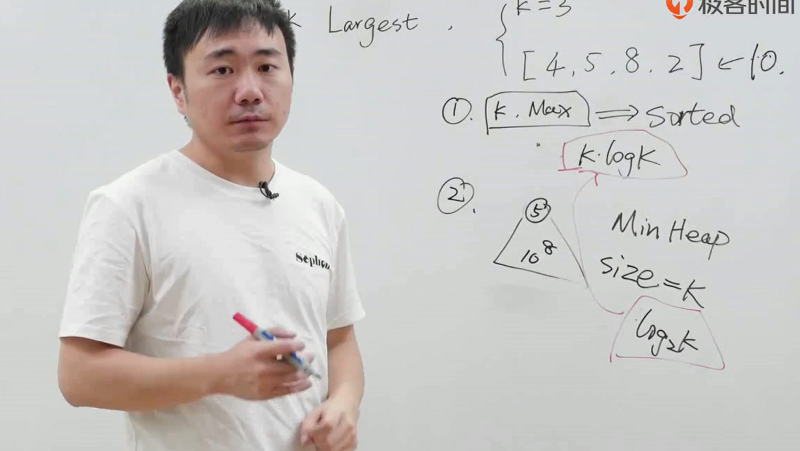
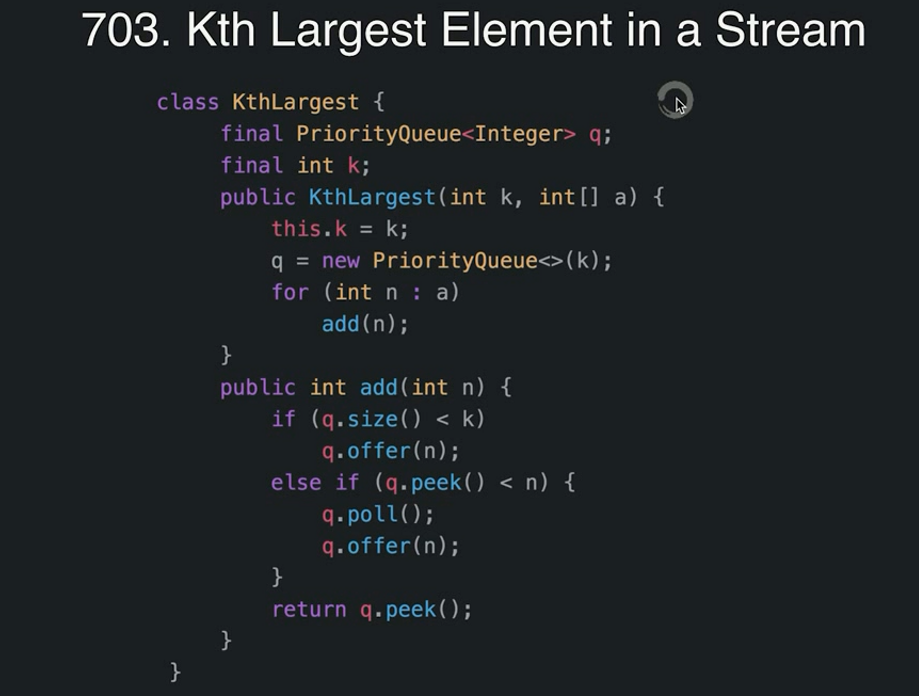

# 面试题_返回数据流中的第K大元素

第K大的元素是多少？

* 如果求最大？
  - 默认取第一个最大，然后依次比较

## 方法一

1. 最大值保存K个，排序，把最小的淘汰，保持始终有K个。
2. 最佳排序快排

## 方法二

* 优先队列，维护一个小顶堆
* 维持堆元素个数始终是K个
* 堆顶最小
* 每次与堆顶比较
  - 如果幸运，比较的比堆顶小o(1)出结果
  - 如果不行，需要调整堆顶，删掉堆顶，然后把新的加进来
  - 在量大的情况下

 

---
