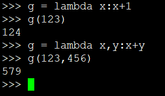

# 字符串中按照字母出现字数排序


## Python解法

```
class Solution:
    def frequencySort(self, s: str) -> str:
        hashMap = {}
        for i in s:
            if i not in hashMap:
                hashMap[i] = 1
            else:
                hashMap[i] += 1
        data = [[i, hashMap[i]] for i in hashMap]
        data.sort(key = lambda x: x[1], reverse=True)
        res= ""
        for i in data:
            res += i[0] * i[1]
        return res
```

```
sort()方法语法：

list.sort(cmp=None, key=None, reverse=False)
参数
cmp -- 可选参数, 如果指定了该参数会使用该参数的方法进行排序。
key -- 主要是用来进行比较的元素，只有一个参数，具体的函数的参数就是取自于可迭代对象中，指定可迭代对象中的一个元素来进行排序。
reverse -- 排序规则，reverse = True 降序， reverse = False 升序（默认）。
```

 
