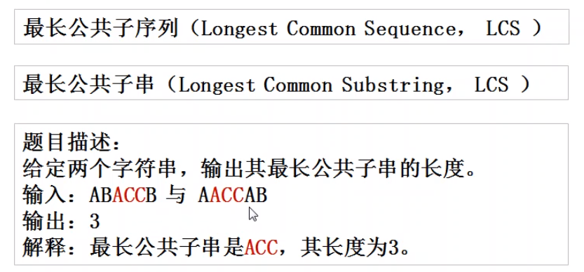
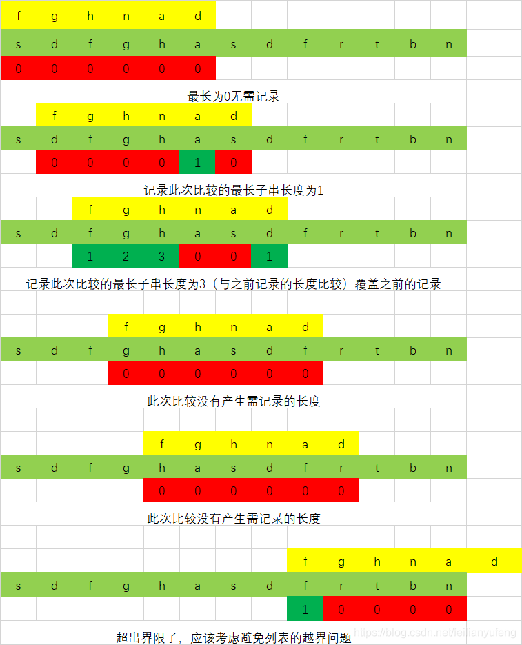

# 最长公共字符串的长度

* <https://www.nowcoder.com/practice/f33f5adc55f444baa0e0ca87ad8a6aac?tpId=190&&tqId=36002&rp=1&ru=/ta/job-code-high-rd&qru=/ta/job-code-high-rd/question-ranking>



最长公共子串（Longest Common Substring）： 是指两个字符串中最长连续相同的子串长度。

例如：str1=“1AB2345CD”,str2=”12345EF”,则str1，str2的最长公共子串为2345。

* 公共子串： 字符必须连续
* 公共子序列：字符不要求连续

## Python解法

牛客网python第一解法

滑动窗口



1. 先选最小串

```
class Solution:
    def LCS(self , str1 , str2 ):
        # write code here
        if len(str1) > len(str2):
            str1, str2 = str2, str1

        max_len, res = 0, ''

        for i in range(len(str1)):
            if str1[i-max_len: i + 1] in str2:
                res = str1[i-max_len: i + 1]
                max_len += 1

        if not res:
            return '-1'
        else:
            return res
```

```
def get_longest_comment_sub_string(s1: str, s2: str):
    s1_len = len(s1)
    s2_len = len(s2)
    # 确定长字符串，短串
    (long_str, shot_str, max_len, min_len) = (s1, s2, s1_len, s2_len) if s1_len > s2_len else (s2, s1, s2_len, s1_len)
    # 记录最长子串长度
    max_count = 0
    # 记录最长子串
    sub_str = None
    # 记录匹配的长度
    match_count = 0
    # 窗口从长串开始滑动
    for i in range(max_len):
        # 计算长串剩余的长度
        left_len = max_len - i
        # 确定需要计数的长度,防止列表越界
        count_len = min(min_len, left_len)
        for j in range(count_len):
            if long_str[i + j] == shot_str[j]:
                match_count += 1
                if match_count > max_count:
                    # 记录长度
                    max_count = match_count
                    # 记录子串
                    sub_str = shot_str[j + 1- match_count : j + 1]
            else:
                # 记录归0
                match_count = 0
        # 这里要归0 很重要（如果这层循环尾部字符正好相同，不归0会出BUG）
        match_count = 0
    return sub_str
```

## 参考

* <https://blog.csdn.net/feilianyufeng/article/details/109750160>


---
